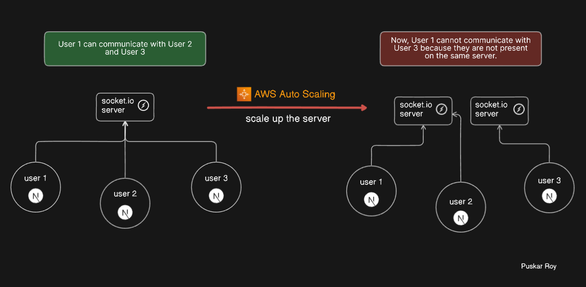

# Upscaling Node.js + Socket.IO Server

When scaling a Node.js + Socket.IO server, you might encounter several issues related to maintaining user connections and state consistency across multiple server instances. This document outlines common problems and provides solutions for effectively scaling your Socket.IO server.

### Issues You Might Face

## User Connections Across Multiple Servers

### Problem

 When you scale horizontally by creating multiple server instances, users may get connected to different servers. This fragmentation can disrupt real-time communication as users connected to different instances cannot interact with each other seamlessly

 

 ### Solution

 Use a message broker like Redis to share connection information and state across all server instances. This ensures that messages and events are broadcasted to all users, regardless of the server instance they are connected to.
